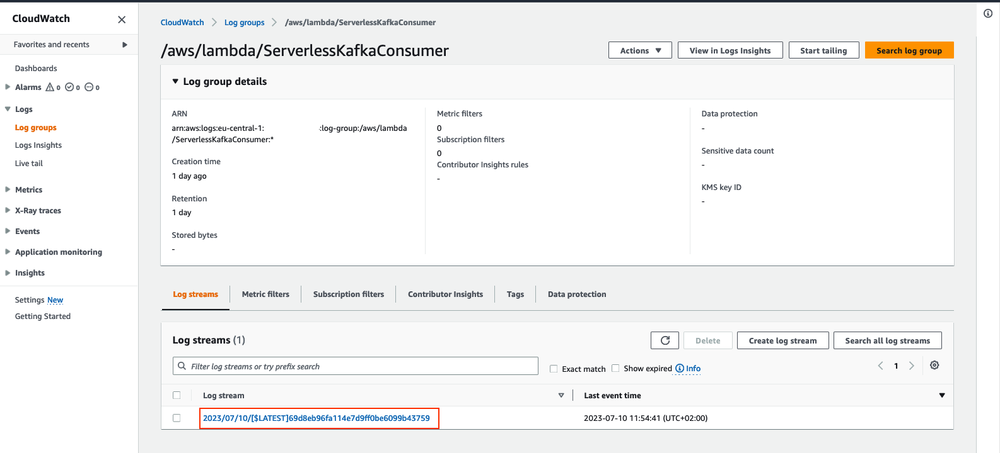

# API-Gateway Lambda MSK Serverless Integration

[](https://github.com/aws-samples/serverless-kafka-producer/actions/workflows/maven-producer.yml) [](https://github.com/aws-samples/serverless-kafka-producer/actions/workflows/maven-handler.yml) [](https://github.com/aws-samples/serverless-kafka-producer/actions/workflows/cdk-test.yml)

## Getting started...

This example walks you through how to build a Serverless End-to-End Apache Kafka integration application using [Amazon](https://docs.aws.amazon.com/msk/latest/developerguide/serverless.html) [MSK Serverless](https://docs.aws.amazon.com/msk/latest/developerguide/serverless.html), [Amazon API Gateway](https://aws.amazon.com/api-gateway/) and [AWS Lambda](https://aws.amazon.com/lambda/).

For testing, this repo includes a sample [AWS Cloud Development Kit (CDK)](https://docs.aws.amazon.com/cdk/v2/guide/home.html) application. This creates a demo environment, including an [Amazon MSK Serverless ](https://docs.aws.amazon.com/msk/latest/developerguide/serverless.html)cluster, three AWS Lambda functions and an Amazon API Gateway.

The following diagram shows the architecture of the resulting application including its data flows:


1. The infrastructure is defined in an AWS Cloud Development Kit application. By running this application a set
   of AWS CloudFormation-templates is created and uploaded to AWS CloudFormation
2. AWS CloudFormation creates all infrastructure components incl. a Lambda Function that runs during the deployment process to create a topic in the Amazon MSK Serverless cluster and to retrieve the authentication endpoint needed for the Producer Lambda function. On destruction of the CloudFormation-stack the same AWS Lambda Function gets triggered again to delete the topic from the cluster.
3. An external application calls an Amazon API Gateway-endpoint
4. Amazon API Gateway forwards the request to an AWS Lambda function
5. AWS Lambda function acts as a Kafka producer and pushes the message to a Kafka topic using IAM Authentication
6. The AWS Lambda Event Source Mapping mechanism triggers the Consumer Lambda and forwards the message to it.
7. Lambda Consumer logs the data to Amazon CloudWatch

Note that we don’t need to worry about availability zones. MSK Serverless automatically replicates the data across multiple availability zones to ensure high availability of the data.

The demo additionally shows how to use [Lambda Powertools for Java](https://awslabs.github.io/aws-lambda-powertools-java/) to streamline logging and tracing and the IAM authenticator for the simple authentication process outlined in the introduction.

## Infrastructure setup

The following sections take you through the steps to deploy, test, and observe the example application.

### Prerequisites

The example has the following prerequisites:

* An AWS account. If you
  haven’t signed up:
  * Create an account. For instructions, see [Sign Up For AWS](https://lakeformation.aworkshop.io/30-prerequisite/301-sign-up-aws.html).
  * Create an [AWS Identity and Access Management](http://aws.amazon.com/iam) (IAM) user. For instructions, see [Create IAM User](https://lakeformation.aworkshop.io/30-prerequisite/302-create-iam-account.html).
* The following software installed on your development machine, or use an AWS Cloud9 environment,
  which comes with all requirements preinstalled:
  * Java Development Kit 17 or higher (for example, [Amazon Corretto 17](https://docs.aws.amazon.com/corretto/index.html), [OpenJDK 17](https://openjdk.java.net/projects/jdk/17/))
  * [Python](https://www.python.org/) version 3.11 or higher
  * [Apache Maven](https://maven.apache.org/download.cgi) version 3.8.4 or higher
  * [Docker](https://docs.docker.com/get-docker/) version 24.0.2 or higher
  * [Node.js](https://nodejs.org/en/download/) v18.0.0
  * [AWS CLI](https://docs.aws.amazon.com/cli/latest/userguide/cli-chap-install.html) 2.12.1 or higher
  * [AWS CDK](https://docs.aws.amazon.com/cdk/v2/guide/getting_started.html) 2.89.0 or higher

·       Ensure that you have appropriate [AWS credentials](https://docs.aws.amazon.com/cli/latest/userguide/cli-configure-files.html) for interacting with resources in your AWS account

### Example walkthrough

Change current directory to subdirectory “serverless-kafka-iac” (if not already in)

```
$ cd serverless-kafka-iac
```

Configure environment variables

```
$ export CDK_DEFAULT_ACCOUNT=$(aws sts get-caller-identity --query 'Account' --output text)
export CDK_DEFAULT_REGION=$(aws configure get region)
```

Create a python virtual environment

```
$ python3 -m venv .venv
```

After the init process completes and the virtualenv is created, you can use the following
step to activate your virtualenv.

```
$ source .venv/bin/activate
```

Install cdk requirements

```
$ pip3 install -r requirements.txt
```

Bootstrap your account for CDK usage

```
$ cdk bootstrap aws://$CDK_DEFAULT_ACCOUNT/$CDK_DEFAULT_REGION
```

Run cdk synth to build code and test requirements

```
$ cdk synth
```

Run ‘cdk deploy’ to deploy the code to your AWS account

```
$ cdk deploy --all
```

## Testing the example

Open a terminal on your development machine to test the API with the bash script provided under "/serverless_kafka_iac/test-api.sh"

(On Windows-machines, please use sample in bash script to construct a similar Windows-"aws apigateway test-invoke-method"-cli-call):

```
$ ./test-api.sh
```


Go to the Lambda Console and open the Lambda-function named "ServerlessKafkaConsumer"


On the Monitor-Tab of the Lambda Console click the “View Cloudwatch Logs”-Button to access the logs of the Lambda Function


Click on the latest Log stream to access the log files of the last run



See the log entry of the received Kafka messages in the log of the Lambda Function


For load testing the application, which is important to calibrate the parameters, you can go with a tool like Artillery to simulate workloads. You can find a sample artillery script in the /load-testing folder.

## Cleaning up

Within the subdirectory “serverless-kafka-iac”, delete the test infrastructure:

```
$ cdk destroy –all 
```

## Useful commands

* `cdk ls`          list all stacks in the app
* `cdk synth`       emits the synthesized CloudFormation template
* `cdk deploy`      deploy this stack to your default AWS account/region
* `cdk diff`        compare deployed stack with current state
* `cdk docs`        open CDK documentation

Enjoy!

## Security

See [CONTRIBUTING](CONTRIBUTING.md#security-issue-notifications) for more information.

## License

This library is licensed under the MIT-0 License. See the LICENSE fil
